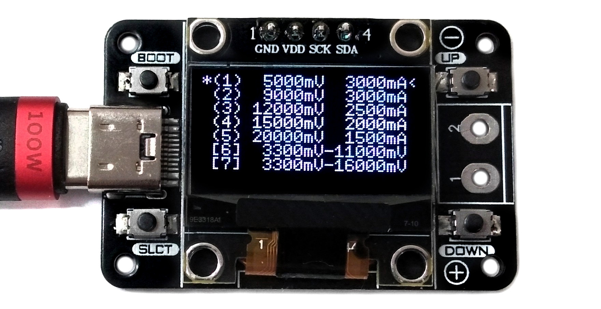

<h1 align="center">⚡ USB PD Tester — CH32X035 (Custom Hardware)</h1>

  A USB-C Power Delivery trigger and voltage monitor built using the CH32X035 microcontroller. 
  Custom PCB designed by me, firmware proudly credited to <a href="https://github.com/wagiminator/CH32X035-USB-PD-Tester" target="_blank">wagiminator</a>.

  

---

## 🧠 What This Is

This project is a hardware-focused adaptation of the original [CH32X035 USB PD Tester](https://github.com/wagiminator/CH32X035-USB-PD-Tester).  
I redesigned the PCB to suit my workflow, added better headers, and ensured fabrication is smooth with Indian PCB vendors.

> ⚠️ Firmware remains untouched from the original project.  
> All firmware credits belong to **[@wagiminator](https://github.com/wagiminator)**.

---

## 🧰 Highlights

  
  
  
  

---

## 🧩 My Contributions

🔧 **Custom PCB Design**  
- Redesigned layout with clearer silkscreen, compact routing, and tested trace widths  
- Added debug headers (UART/SWD) for future firmware hacking  
- Re-aligned buttons and OLED screen for better usability and assembly

📸 **Testing and Assembly**  
- Fabricated via local Indian vendors (multi-layer process verified)  
- Soldered and tested with 65W USB-C PD charger  
- Measured real-time voltage switching on OLED display

---

